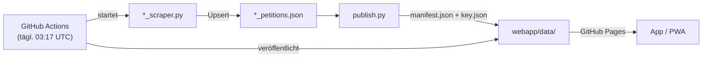

# PetitionsManager

Ein Python-Scraper-Backend, das täglich Petitionen von elf Plattformen sammelt,
und eine mobile Web-App (PWA/APK), die diese Daten offline durchsuchbar macht.

[](https://github.com/PetitionsManager/petitionsmanager/actions/workflows/scrape.yml)
[](https://github.com/PetitionsManager/petitionsmanager/actions/workflows/build-apk.yml)
[](LICENSE)

---

## Was es kann

### App (`webapp/`)

- Petitionen aus allen aktivierten Plattformen in einer scrollbaren Liste
- Plattformübergreifende Volltextsuche
- Ähnliche Petitionen (Empfehlungen anhand gemeinsamer Schlagwörter)
- Petitionen nach Tags filtern; Tags werden automatisch aus Titeln und Texten abgeleitet
- Favoriten-Plattformen anpinnen, Petitionen als „unterschrieben" oder archiviert markieren
- Wischgesten: rechts = unterschrieben, links = archivieren
- Persönliche Daten (Favoriten, Status) exportieren und importieren
- Offline-fähig dank Service Worker; installierbar als PWA (Android/iOS)
- Konfigurierbare Datenquelle: Standard ist GitHub Pages, kann auf eigenen Host umgestellt werden

### Scraper/Backend

- 11 Live-Plattformen, jede in einem eigenen Scraper-Modul
- Daten werden per Upsert akkumuliert, nie überschrieben — Verlaufsdaten bleiben erhalten
- Unterschriftenverlauf als Zeitreihe, Meilensteine, Plattform-Neuigkeiten
- Automatischer 24-Stunden-Mindestabstand pro Petition (spart Anfragen)
- Health-Check (`--check`): prüft alle Entdeckungsquellen schnell ohne vollständigen Scrape
- Lokaler Dashboard-Server (`--serve`) mit „Jetzt scrapen"-Schaltflächen
- Täglicher Lauf via GitHub Actions, Veröffentlichung über GitHub Pages
- Datensatz-Warnung bei unerwartetem Einbruch des Online-Bestands
- Offline-Bestätigung: eine Petition wird erst nach mehreren Fehlschlägen auf „offline" gesetzt

---

## Die Plattformen

| Plattform | Sprache | Quelle | Offenheit |
|---|---|---|---|
| WeAct | de | https://weact.campact.de/ | 4 — offen |
| Avaaz | de | https://secure.avaaz.org/community_petitions/de/ | 2 — eingeschränkt |
| OpenPetition | de | https://www.openpetition.de/petitionen | 5 — sehr offen |
| Change.org | de | https://www.change.org/?lang=de-DE | 3 — mittel |
| Bundestag ePetitionen | de | https://epetitionen.bundestag.de/epet/petuebersicht/mz.nc.html | 2 — eingeschränkt |
| Eko | de | https://eko.org/de/campaigns | 3 — mittel |
| Innn.it | de | https://innn.it/ | 3 — mittel |
| WeMove Europe | de | https://wemove.eu/de/campaigns | 3 — mittel |
| Europäisches Parlament | en | https://www.europarl.europa.eu/petitions/en/home | 4 — offen |
| foodwatch | de | https://www.foodwatch.org/de/mitmachen | 5 — sehr offen |
| 350.org | de | https://350.org/de/mitmachen/ | 3 — mittel |

**Offenheits-Ampel** (1–5): Wie vollständig und direkt eine Plattform ihre Daten
zugänglich macht. 5 = vollständige öffentliche Liste, server-gerendert, großzügige
robots.txt. 1 = keine Liste, Bot-Schutz, keine maschinenlesbaren Daten.

**Kurznotizen je Plattform:**

- **WeAct** — vollständige Listen über Kategorien und Paginierung, aber Custom-Elemente statt
  Links und versteckter `cpage`-Parameter
- **Avaaz** — keine öffentliche Gesamtliste (nur ~5–10 kuratierte Einträge), Cloudflare
  blockt Nicht-Browser-Clients; Archiv-Entdeckung über das Internet Archive
- **OpenPetition** — vorbildlich: ~1.600 paginierte Petitionen, alles server-gerendert,
  großzügige robots.txt mit Sitemap
- **Change.org** — deutsche Themenseiten plus Sitemap-Heuristik; das `/api-proxy/`-Endpunkt
  ist per robots.txt gesperrt und wird nicht genutzt
- **Bundestag** — offizielle Daten, aber JS-Portal mit Session-Cookies und verstecktem
  AJAX-Fragment (Reverse-Engineering erforderlich)
- **Eko** — deutsche Kampagnen über Startseite und Suche, Vollständigkeit nicht garantiert
- **Innn.it** — vollständige Liste nur über verstecktes internes API (per Reverse-Engineering
  gefunden); liefert dafür vollständige Datensätze inkl. Volltext
- **WeMove Europe** — Kampagnen inkl. Archiv, Zähler über separaten Progress-Endpoint
- **EU-Parlament** — offizielle PETI-Petitionen aus Deutschland, Texte auf Englisch;
  keine öffentliche Unterstützerzahl
- **foodwatch** — komplette Aktionsliste, Zähler und Volltexte direkt im HTML
- **350.org** — Klima-Aktionen (Petitionen, E-Mail- und Brief-Aktionen) über externe
  JSON-API; `/act/`-Seiten sind per robots.txt gesperrt und werden nicht geladen

---

## Loslegen

**Voraussetzungen:** Python 3.12, `pip install -r requirements.txt`
(installiert `requests` und `beautifulsoup4`).

```bash
# Alle Live-Plattformen scrapen
python3 monitor.py

# Nur eine Plattform
python3 monitor.py --platform openpetition

# Scrape auf N neue Petitionen begrenzen (gut zum Testen)
python3 monitor.py --platform weact --limit 20

# Health-Check: prüft alle Entdeckungsquellen ohne vollständigen Scrape
# (Exit-Code 1, wenn eine Quelle nicht antwortet)
python3 monitor.py --check

# Lokalen Dashboard-Server starten (Port 8000, mit „Jetzt scrapen"-Buttons)
python3 monitor.py --serve

# App-Daten für webapp/ erzeugen (nach jedem Scrape ausführen)
python3 publish.py
```

Weitere Optionen:

| Flag | Bedeutung |
|---|---|
| `--no-recheck` | Nur neue Petitionen scrapen, bekannte überspringen |
| `--force` | 24-Stunden-Mindestabstand ignorieren |
| `--min-interval-hours N` | Mindestabstand anpassen (0 = immer prüfen) |
| `--delay N` | Pause zwischen Anfragen in Sekunden (Standard: 1,5 s) |
| `--html-only` | Nur HTML aus vorhandenen JSONs neu bauen, kein Scrape |

---

## Wie die Daten fließen

```
Scraper-Module         Lokale JSON-Stores       Web-App-Daten
(weact_scraper.py      →  weact_petitions.json  ─┐
 avaaz_scraper.py      →  avaaz_petitions.json   │
 …)                    →  *_petitions.json     ──┴─→ publish.py ──→ webapp/data/*.json
                                                                         │
                                                           GitHub Pages (tägl. Actions-Lauf)
                                                                         │
                                                                    App im Browser
                                                           https://petitionsmanager.github.io/
                                                                  petitionsmanager/
```



Der tägliche Workflow (`.github/workflows/scrape.yml`) läuft um 03:17 UTC,
cacht die `*_petitions.json`-Dateien zwischen den Läufen (das Repo wächst
dadurch nicht mit jedem Lauf) und veröffentlicht `webapp/` auf GitHub Pages.

Das Dashboard (Überblick aller Plattformen mit Zählern) ist nach dem Lauf unter
`https://petitionsmanager.github.io/petitionsmanager/dashboard.html` erreichbar.

---

## Die App nutzen

### Als PWA im Browser installieren

Sobald `webapp/` auf einem https-Host liegt (z. B. GitHub Pages), lässt sich
die App direkt installieren:

- **Android (Chrome/Firefox):** „Zum Startbildschirm hinzufügen" im Browsermenü
- **iOS (Safari):** Teilen-Schaltfläche → „Zum Home-Bildschirm"

Die App funktioniert nach der Installation offline: der Service Worker
(`webapp/sw.js`) cacht die App-Hülle und bereits geladene Plattformdaten.

### Android-APK

Eine native Android-APK lässt sich ohne lokale Android-Toolchain über GitHub
Actions bauen:

1. Actions-Tab → **„Build APK"** → **„Run workflow"**
2. Nach ~3–5 Minuten das Artefakt **`PetitionsManager-debug-apk`** herunterladen
3. APK auf dem Gerät installieren (Installation aus „unbekannten Quellen" erlauben)

Vor dem Build `python3 publish.py` ausführen, damit die APK frische Daten enthält.
Die Daten werden direkt aus `webapp/` gebündelt — keine separate Kopie.

Details und lokaler Build (Android Studio / Gradle): [`android/README-APK.md`](android/README-APK.md)

---

## Fairness beim Scrapen

Der Monitor hält sich bewusst an folgende Regeln:

- **robots.txt wird geladen und respektiert** — jede gesperrte URL wird
  stillschweigend übersprungen. Ist die robots.txt nicht abrufbar (z. B. wegen
  Cloudflare), verhält sich der Scraper konservativ.
- **Pause zwischen Anfragen** — Standard 1,5 Sekunden, konfigurierbar per
  `--delay`. API-Endpoints oder ressourcenintensive Seiten bekommen mehr Abstand.
- **24-Stunden-Mindestabstand pro Petition** — eine bereits bekannte Petition
  wird frühestens nach 24 Stunden erneut abgerufen. So werden auch tägliche
  CI-Läufe nicht zur Dauerbelastung.
- **Keine Umgehung von Bot-Schutz** — Endpoints, die durch WAF oder
  JavaScript-Challenges geschützt sind, werden nicht mit Tricks umgangen. Wenn
  eine Plattform blockiert, bleibt der vorhandene Datenstand erhalten.
- **Kein Massendownload auf Vorrat** — es werden nur Petitionen abgerufen,
  die wirklich neu sind oder deren letzte Prüfung mehr als 24 Stunden zurückliegt.

---

## Projektstruktur

```
PetitionsManager/
├── monitor.py             Zentraler Einstiegspunkt; bindet alle Scraper zusammen
├── petitions_core.py      Gemeinsames Kernmodul: Fetcher, Datenhaltung, HTML-Erzeugung
├── publish.py             Erzeugt webapp/data/*.json aus den lokalen JSON-Stores
├── *_scraper.py           Ein Modul pro Plattform (z. B. weact_scraper.py)
├── *_petitions.json       Lokale Datenstores (werden von Git ignoriert / gecacht)
├── *_petitions.html       Lokale Listen-Ansichten (eine pro Plattform)
├── dashboard.html         Übersicht aller Plattformen (lokal + via Pages)
├── requirements.txt       Python-Abhängigkeiten (requests, beautifulsoup4)
├── webapp/
│   ├── index.html         App-Einstieg
│   ├── app.js             Komplette App-Logik (Vanilla JS, kein Framework)
│   ├── style.css          App-Styles
│   ├── manifest.webmanifest  PWA-Manifest
│   ├── sw.js              Service Worker (Offline-Cache)
│   └── data/              Von publish.py erzeugte App-Daten
│       ├── manifest.json  Plattform-Metadaten + Zähler
│       └── <key>.json     Petitionen je Plattform
├── android/
│   ├── README-APK.md      Bauanleitung für die Android-APK
│   └── …                  Android-Projektdateien (Gradle, WebView-Wrapper)
└── .github/workflows/
    ├── scrape.yml         Täglicher Scrape + GitHub-Pages-Deploy
    └── build-apk.yml      Cloud-APK-Build (manuell oder bei Push)
```

---

## Mitmachen

### Neue Plattform vorschlagen

Ein Issue im Repository reicht: Plattform-URL, kurze Einschätzung zur
Zugänglichkeit (gibt es eine öffentliche Liste? server-gerendert oder SPA?
robots.txt?) und ob du selbst einen Scraper schreiben möchtest.

### Neuen Scraper beisteuern

Jede Plattform ist ein eigenständiges Modul. Das Muster:

```python
# beispiel_scraper.py
from pathlib import Path
from petitions_core import Platform

DATA_FILE = Path("beispiel_petitions.json")
HTML_FILE = Path("beispiel_petitions.html")

PLATFORM = Platform(
    key="beispiel",
    name="Beispiel-Plattform",
    source_url="https://beispiel.de/petitionen",
    data_file=DATA_FILE,
    html_file=HTML_FILE,
    run=run,      # run(args): Scrape-Ablauf
    check=check,  # check(fetcher) -> (ok: bool, detail: str): Health-Check
    openness=3,
    openness_note="Kurze Begründung der Offenheits-Stufe.",
    language="de",
)

def run(args) -> None:
    # Discovery (welche Petitionen gibt es?)
    # Detail-Scrape pro Petition
    # core.upsert(store, slug, new_data, list_hint, status, ts, url)
    # core.save_store(store, DATA_FILE)
    ...

def check(fetcher) -> tuple[bool, str]:
    # Leichte Prüfung der Entdeckungsquelle, wenige Requests
    ...
```

Danach das Modul in `monitor.py` importieren und in die `PLATFORMS`-Liste
eintragen. `python3 monitor.py --check` zeigt, ob der Health-Check funktioniert.

Die vollständige API (Fetcher, upsert, save_store, check_source, make_tags …)
ist in `petitions_core.py` dokumentiert.

---

## Lizenz

GNU General Public License v3 — siehe [`LICENSE`](LICENSE).

---

## English summary

PetitionsManager is a Python scraper backend and a mobile web app (PWA/Android
APK) for tracking petitions across eleven German-language and European platforms.
The scraper runs daily via GitHub Actions, respects robots.txt and rate limits,
and publishes slim JSON data to GitHub Pages. The app loads those data files,
works offline, and supports cross-platform search, tag filtering, swipe gestures,
and personal bookmarks.
