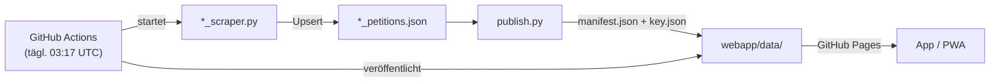

# PetitionsManager

Ein Python-Scraper-Backend, das täglich Petitionen von elf Plattformen sammelt,
und eine mobile Web-App (PWA/APK), die diese Daten offline durchsuchbar macht.

[](https://github.com/PetitionsManager/petitionsmanager/actions/workflows/scrape.yml)
[](https://github.com/PetitionsManager/petitionsmanager/actions/workflows/build-apk.yml)
[](https://github.com/PetitionsManager/petitionsmanager/actions/workflows/checks.yml)
[](LICENSE)

---

## Was es kann

### App (`webapp/`)

- Petitionen aus allen aktivierten Plattformen in einer scrollbaren Liste
- Plattformübergreifende Volltextsuche, mit Vorschlagsliste beim Tippen
  (Hauptseite, Plattformseite und Liste der unterzeichneten Petitionen)
- Ähnliche Petitionen: gemeinsame Schlagwörter, Titel- und Textüberschneidung,
  mit Zuschlag für ein *seltenes* gemeinsames Schlagwort — so finden sich auch
  Petitionen zur selben Marke über Plattformgrenzen hinweg. Bis zu zwölf je
  Petition; 99,9 % aller vergleichbaren Petitionen haben welche (die Lücke sind
  Datensätze, die von ihrer Quelle ohne Titel und ohne Text kommen)
- Petitionen nach Tags filtern; Tags werden automatisch aus Titeln und Texten abgeleitet
- Favoriten-Plattformen anpinnen, Petitionen als „unterschrieben" oder archiviert markieren
- Wischgesten: rechts = unterschrieben, links = archivieren
- Tägliche Erinnerung mit einstellbarer Uhrzeit; auf Wunsch nur, wenn es neue
  Petitionen gibt. In der Android-Fassung übernimmt das ein Weckruf des Systems,
  im Browser erscheint die Meldung beim nächsten Öffnen der App
- Zwei Layouts (Relief im Stil des Neumorphismus, Magazin als Kachelraster)
  und ein Dunkelmodus, der auch der Systemeinstellung folgen kann
- Zweisprachige Oberfläche (Deutsch, Englisch); Vorgabe ist die Systemsprache,
  umstellbar in den Einstellungen und im Einrichtungs-Assistenten
  (siehe „Neue Sprache beisteuern")
- Persönliche Daten (Favoriten, Status) exportieren und importieren
- Offline-fähig dank Service Worker; installierbar als PWA (Android/iOS)
- Konfigurierbare Datenquelle: Standard ist GitHub Pages, kann auf eigenen Host umgestellt werden

### Scraper/Backend

- 11 Live-Plattformen, jede in einem eigenen Scraper-Modul
- Daten werden per Upsert akkumuliert, nie überschrieben — Verlaufsdaten bleiben erhalten
- Unterschriftenverlauf als Zeitreihe, Meilensteine, Plattform-Neuigkeiten
- Automatischer 24-Stunden-Mindestabstand pro Petition (spart Anfragen)
- Health-Check (`--check`): prüft alle Entdeckungsquellen schnell ohne vollständigen
  Scrape; eine rote Quelle wird nach kurzer Pause ein zweites Mal versucht (Aussetzer
  hinter Cloudflare sind häufig) und danach in der CI namentlich als Warnung gemeldet
- Lokaler Dashboard-Server (`--serve`) mit „Jetzt scrapen"-Schaltflächen
- Täglicher Lauf via GitHub Actions, Veröffentlichung über GitHub Pages
- **Selbstmeldung: die Scraper melden Teilausfälle selbst.** Ein Lauf kann grün
  aussehen und trotzdem halb kaputt sein — genau das ist dreimal passiert (eine
  Entdeckungsquelle lieferte monatelang null Treffer, ein Ausdruck schnitt Adressen
  ab und erzeugte 81 vermeintlich gelöschte Petitionen, eine Warteschlange brach bei
  Position 30 von 261 ab). Nach jedem Lauf wird der fertige Bestand deshalb auf die
  Spuren dieser Fälle geprüft: leerer Entdeckungszweig · Zuwachs an Datensätzen ohne
  Titel · Slugs, die Anfang eines anderen sind und keinen Titel haben (die Signatur
  einer abgeschnittenen Adresse) · Einbruch des Online-Bestands.
  **Gemeldet wird nur, was sich gegenüber dem Vorlauf verschlechtert hat** — ein
  Hinweis, der täglich steht, wird nach drei Tagen überlesen. Die Kennzahlen jedes
  Laufs stehen als Zeitreihe im `_meta` der Datendatei, die Befunde auf der
  Dashboard-Kachel und im CI als Annotation plus Tabelle in der Lauf-Zusammenfassung.
- Offline-Bestätigung: eine Petition wird erst nach mehreren Fehlschlägen auf „offline" gesetzt

---

## Die Plattformen

| Plattform | Sprache | Quelle | Offenheit |
|---|---|---|---|
| WeAct | de | https://weact.campact.de/ | 4 — offen |
| Avaaz | de | https://secure.avaaz.org/community_petitions/de/ | 2 — eingeschränkt |
| OpenPetition | de | https://www.openpetition.de/petitionen | 5 — sehr offen |
| Change.org | de | https://www.change.org/?lang=de-DE | 3 — mittel |
| Bundestag ePetitionen | de | https://epetitionen.bundestag.de/epet/petuebersicht/mz.nc.html | 2 — eingeschränkt |
| Ekō | de | https://eko.org/de/campaigns | 2 — eingeschränkt |
| Innn.it | de | https://innn.it/ | 3 — mittel |
| WeMove Europe | de | https://wemove.eu/de/campaigns | 3 — mittel |
| Europäisches Parlament | en | https://www.europarl.europa.eu/petitions/en/home | 4 — offen |
| foodwatch | de | https://www.foodwatch.org/de/mitmachen | 5 — sehr offen |
| 350.org | de | https://350.org/de/mitmachen/ | 3 — mittel |

**Offenheits-Ampel** (1–5): Wie vollständig und direkt eine Plattform ihre Daten
zugänglich macht. 5 = vollständige öffentliche Liste, server-gerendert, großzügige
robots.txt. 1 = keine Liste, Bot-Schutz, keine maschinenlesbaren Daten.

**Kurznotizen je Plattform:**

- **WeAct** — vollständige Listen über Kategorien und Paginierung, aber Custom-Elemente statt
  Links und versteckter `cpage`-Parameter
- **Avaaz** — keine öffentliche Gesamtliste (nur ~5–10 kuratierte Einträge), Cloudflare
  blockt Nicht-Browser-Clients; Archiv-Entdeckung über das Internet Archive
- **OpenPetition** — vorbildlich: ~1.600 paginierte Petitionen, alles server-gerendert,
  großzügige robots.txt mit Sitemap
- **Change.org** — deutsche Themenseiten plus Sitemap-Heuristik; das `/api-proxy/`-Endpunkt
  ist per robots.txt gesperrt und wird nicht genutzt
- **Bundestag** — offizielle Daten, aber JS-Portal mit Session-Cookies und verstecktem
  AJAX-Fragment (Reverse-Engineering erforderlich)
- **Ekō** — deutsche Kampagnen über Startseite und Suche, Vollständigkeit nicht
  garantiert (Eigenschreibweise mit Makron, seit der Umbenennung von SumOfUs 2023);
  seit 8.8.2026 liegen die Detailseiten hinter einem Bot-Schutz, neue Aktionen
  kommen deshalb aus der Kampagnenkarte — siehe „Fairness beim Scrapen"
- **Innn.it** — vollständige Liste nur über verstecktes internes API (per Reverse-Engineering
  gefunden); liefert dafür vollständige Datensätze inkl. Volltext
- **WeMove Europe** — Kampagnen inkl. Archiv, Zähler über separaten Progress-Endpoint
- **EU-Parlament** — offizielle PETI-Petitionen aus Deutschland, Texte auf Englisch;
  keine öffentliche Unterstützerzahl
- **foodwatch** — komplette Aktionsliste, Zähler und Volltexte direkt im HTML
- **350.org** — Klima-Aktionen (Petitionen, E-Mail- und Brief-Aktionen) über externe
  JSON-API; `/act/`-Seiten sind per robots.txt gesperrt und werden nicht geladen

---

## Loslegen

**Voraussetzungen:** Python 3.12, `pip install -r requirements.txt`
(installiert `requests` und `beautifulsoup4`).

**Nach einem frischen Klon zuerst die App-Daten holen** – sie liegen bewusst
nicht im Repo (siehe „Android-APK"), die Web-App bliebe sonst leer:

```bash
python3 hole_live_daten.py      # ~60 MB, dauert etwa eine halbe Minute
python3 hole_live_daten.py --pruefen   # nur holen und prüfen, nichts schreiben
python3 hole_live_daten.py --ziel PFAD # in einen anderen Ordner als webapp/data
```

```bash
# Alle Live-Plattformen scrapen
python3 monitor.py

# Nur eine Plattform
python3 monitor.py --platform openpetition

# Scrape auf N neue Petitionen begrenzen (gut zum Testen)
python3 monitor.py --platform weact --limit 20

# Health-Check: prüft alle Entdeckungsquellen ohne vollständigen Scrape
# (Exit-Code 1, wenn eine Quelle nicht antwortet)
python3 monitor.py --check

# Lokalen Dashboard-Server starten (Port 8000, mit „Jetzt scrapen"-Buttons)
python3 monitor.py --serve

# App-Daten für webapp/ erzeugen (nach jedem Scrape ausführen)
python3 publish.py
```

Weitere Optionen:

| Flag | Bedeutung |
|---|---|
| `--no-recheck` | Nur neue Petitionen scrapen, bekannte überspringen |
| `--force` | 24-Stunden-Mindestabstand ignorieren |
| `--min-interval-hours N` | Mindestabstand anpassen (0 = immer prüfen) |
| `--delay N` | Pause zwischen Anfragen in Sekunden (Standard: 1,5 s) |
| `--html-only` | Nur HTML aus vorhandenen JSONs neu bauen, kein Scrape |
| `--archive` | Kandidatenliste im Internet Archive auffrischen (nur `avaaz`) |
| `--archive-batch N` | Archiv-Kandidaten pro Lauf (Standard 120; 0 = keine) |
| `--backfill` | Beendete + archivierte Listen komplett einlesen (nur `bundestag`) |
| `--backfill-batch N` | Fehlende Volltexte pro Lauf nachladen (Standard 300; 0 = keine) |

### Beendete Petitionen (Bundestag)

Der Bundestag führt neben den laufenden Petitionen zwei weitere Listen:
beendete Mitzeichnungsfristen und ein Archiv. Zusammen sind das rund 7.850
Einträge — sie werden deshalb **nicht** bei jedem Lauf geholt:

```bash
# Einmalig: beide Listen komplett einlesen (~655 Anfragen, ca. 15 Minuten).
# Die Datensätze entstehen sofort aus der Listentabelle.
python3 monitor.py --platform bundestag --backfill

# Danach zieht jeder normale Lauf die nächste Portion Volltexte nach.
# Zum Aufholen am Stück (dauert entsprechend lange):
python3 monitor.py --platform bundestag --backfill-batch 3000 --no-recheck
```

Diese Einträge tragen `closed: true` und sind nicht mehr mitzeichenbar. Die
Listenansicht zeigt dafür das Abzeichen **Beendet** und die Filter
*Laufend* / *Beendet*; die Mobile-App sammelt sie in einem eigenen
Abschnitt „Beendet", damit die aktive Liste übersichtlich bleibt.

---

## Wie die Daten fließen

```
Scraper-Module         Lokale JSON-Stores       Web-App-Daten
(weact_scraper.py      →  weact_petitions.json  ─┐
 avaaz_scraper.py      →  avaaz_petitions.json   │
 …)                    →  *_petitions.json     ──┴─→ publish.py ──→ webapp/data/*.json
                                                                         │
                                                           GitHub Pages (tägl. Actions-Lauf)
                                                                         │
                                                                    App im Browser
                                                           https://petitionsmanager.github.io/
                                                                  petitionsmanager/
```



Der tägliche Workflow (`.github/workflows/scrape.yml`) läuft um 03:17 UTC,
cacht die `*_petitions.json`-Dateien zwischen den Läufen (das Repo wächst
dadurch nicht mit jedem Lauf) und veröffentlicht `webapp/` auf GitHub Pages.

Über **Actions → „Scrape & Publish" → „Run workflow"** gibt es zwei Haken:

| Haken | Wirkung |
|---|---|
| `nacharbeit` | Einmalige Nachträge mitlaufen lassen (Bundestag-Phasen 3+4, Avaaz-Archiv) |
| `nur_veroeffentlichen` | **Nicht scrapen**, nur den Stand aus dem Cache neu ausliefern — rund 3 statt 300 Minuten. Für Änderungen an der Web-App oder an `publish.py`, die sonst bis zum Nachtlauf unsichtbar blieben. Ohne gültigen Cache bricht der Lauf ab, statt einen veralteten Stand live zu schieben |

Das Dashboard (Überblick aller Plattformen mit Zählern) ist nach dem Lauf unter
`https://petitionsmanager.github.io/petitionsmanager/dashboard.html` erreichbar.
Es entsteht zur Laufzeit und steht deshalb nicht im Repo; erzeugt wird es von
`monitor.py`, und `publish.py` legt es notfalls selbst an, damit die Adresse
auch nach einem abgebrochenen Lauf nicht ins Leere zeigt.

---

## Die App nutzen

### Als PWA im Browser installieren

Sobald `webapp/` auf einem https-Host liegt (z. B. GitHub Pages), lässt sich
die App direkt installieren:

- **Android (Chrome/Firefox):** „Zum Startbildschirm hinzufügen" im Browsermenü
- **iOS (Safari):** Teilen-Schaltfläche → „Zum Home-Bildschirm"

Die App funktioniert nach der Installation offline: der Service Worker
(`webapp/sw.js`) cacht die App-Hülle und bereits geladene Plattformdaten.

### Android-APK

Eine native Android-APK lässt sich ohne lokale Android-Toolchain über GitHub
Actions bauen:

1. Actions-Tab → **„Build APK"** → **„Run workflow"**
2. Nach ~3–5 Minuten das Artefakt **`PetitionsManager-debug-apk-Daten-JJJJ-MM-TT`**
   herunterladen — der Datenstand steht im Namen
3. APK auf dem Gerät installieren (Installation aus „unbekannten Quellen" erlauben)

**Die Daten holt der Bau selbst.** Vor dem Gradle-Lauf lädt
`hole_live_daten.py` den veröffentlichten Stand von GitHub Pages nach
`webapp/data` und prüft ihn: Anzahl je Plattform gegen das Manifest, jeder
Volltext-Verweis auf ein vorhandenes Paket, Stichprobe auf den Text selbst.
Stimmt etwas nicht oder ist Pages nicht erreichbar, **bricht der Bau ab** —
eine APK mit altem Datenstand sähe fertig aus und wäre es nicht.

`webapp/data` liegt deshalb **nicht mehr im Repo** (`.gitignore`): der Ordner
ist erzeugte Ausgabe, keine Quelle. Es gibt genau einen Weg zu den Daten, und
der ist immer aktuell.

Das war lange anders und der Grund für eine stille Lücke: Pages wird per
Artefakt beliefert, nicht per Commit, der APK-Bau las aber aus dem Checkout —
am 7.8.2026 trug die APK 14.354 Petitionen, live waren es 17.383. Regelmäßig
zu committen wäre keine Lösung gewesen, sondern ein zweites Problem: der
Ordner stellte mit 68,9 MB bereits 67 % des Repos, bei nur vier Ständen in der
Historie (~17 MB je Stand). Die Historie ist am selben Tag bereinigt worden,
das Repo dadurch von 102 MB auf 11 MB geschrumpft.

**Jede APK trägt eine eigene Fassung.** Der Workflow setzt `VERSION_CODE` auf
`github.run_number` und `VERSION_NAME` auf `1.0.<Lauf>`; `android/app/build.gradle`
liest beides aus der Umgebung. Die Lauf-Nummer zählt monoton hoch und springt
nie zurück — genau das verlangt Android von einem Update. Ohne die Variablen
(lokaler Bau) bleibt es bei `versionCode 1` und `versionName 1.0`.

Details und lokaler Build (Android Studio / Gradle): [`android/README-APK.md`](android/README-APK.md)

### Signaturschlüssel einrichten

Android erlaubt das Überinstallieren nur, wenn die neue APK **mit demselben
Schlüssel** signiert ist wie die alte. Ohne festen Schlüssel erzeugt Gradle sich
auf jedem GitHub-Runner einen neuen — jede APK galt dann als fremde App
(„Das Paket steht in einem Konflikt mit einem bestehenden Paket"), und vor
jeder neuen Fassung musste man deinstallieren und verlor Merkliste und
Einstellungen.

Der Schlüssel liegt deshalb als **Repository-Secret**, nicht im Repo:

| Secret | Inhalt |
|---|---|
| `SIGNING_KEYSTORE_BASE64` | PKCS12-Keystore, base64-kodiert in **einer** Zeile |
| `SIGNING_KEYSTORE_PASSWORD` | Das Passwort dieses Keystores |

`build-apk.yml` schreibt den Schlüssel zur Bauzeit nach
`android/app/signing.p12` und entfernt ihn nach dem Signieren wieder;
`*.p12`, `*.jks` und `*.keystore` stehen in `.gitignore`.

**Ohne die Secrets läuft der Bau weiter**, warnt aber deutlich: die APK ist dann
mit Gradles Wegwerf-Debugschlüssel signiert und lässt sich **nicht** über eine
vorhandene Installation legen. Für einen lokalen Testbau ist das richtig, für
eine Auslieferung nicht.

**Eigenen Keystore erzeugen** — mit `openssl`, ein `keytool` wird nicht
gebraucht (Java 17 liest PKCS12 nativ):

```bash
# 1. Schlüssel + selbstsigniertes Zertifikat (RSA 4096, ~35 Jahre gültig).
#    Das Zertifikat muss die gesamte Lebensdauer der App abdecken – ist es
#    abgelaufen, lässt sich nie wieder ein Update signieren.
openssl req -x509 -newkey rsa:4096 -sha256 -days 12800 -nodes \
  -keyout schluessel.pem -out zertifikat.pem \
  -subj "/CN=PetitionsManager/O=PetitionsManager/C=DE"

# 2. Beides in einen PKCS12-Keystore packen.
#    ⚠️ Der Alias MUSS "petitionsmanager" heißen – genau den erwartet
#    android/app/build.gradle (keyAlias).
openssl pkcs12 -export -name petitionsmanager \
  -inkey schluessel.pem -in zertifikat.pem \
  -out signing.p12 -passout pass:DEIN_PASSWORT

# 3. In EINE base64-Zeile umwandeln. Ohne -w0 bricht base64 um, und ein
#    umgebrochen eingefügtes Secret ergibt eine unbrauchbare Datei.
base64 -w0 signing.p12 > signing.p12.b64     # macOS: base64 -i signing.p12
```

Inhalt von `signing.p12.b64` als `SIGNING_KEYSTORE_BASE64` hinterlegen
(Settings → Secrets and variables → Actions), das Passwort als
`SIGNING_KEYSTORE_PASSWORD`. Danach die `.pem`-Dateien löschen — die
`signing.p12` dagegen **sicher aufbewahren**: Geht sie verloren, lässt sich
keine bestehende Installation je wieder aktualisieren.

Der Workflow prüft die hergestellte Datei auf Mindestgröße (1.000 Bytes) und
bricht ab, wenn das Secret unvollständig eingefügt wurde — `base64 -d` schreibt
ein abgeschnittenes Secret sonst klaglos in eine kaputte Datei. Nach dem Bau
weist er den SHA-256-Fingerabdruck des Signaturzertifikats im Protokoll aus:
weicht er eines Tages ab, steht es dort und nicht erst auf dem Telefon.

> Der erste Anlauf legte den Schlüssel offen ins Repo. Für einen reinen
> Debug-Schlüssel war das vertretbar, für Google Play und F-Droid nicht: ein
> Schlüssel, der je öffentlich war, ist verbrannt und lässt sich nicht
> nachträglich retten. Der alte `debug.p12` gilt als kompromittiert und wurde
> ersetzt.

### Geplant: Google Play und F-Droid

Beide Stores sind angedacht, beide sind noch offen. Was dafür zu klären ist:

- **Google Play verlangt ein AAB**, kein APK — also `bundleRelease` statt
  `assembleDebug`, und damit ein Release-Buildtyp mit eigener `signingConfig`.
- **Play App Signing** verwahrt den Auslieferungsschlüssel bei Google; man lädt
  nur noch mit dem Upload-Schlüssel hoch. Das ist eine Einbahnstraße und
  entscheidet mit, was aus dem Schlüssel oben wird.
- **F-Droid baut aus dem Quellcode** und signiert mit **eigenem** Schlüssel. Die
  F-Droid-Fassung ist damit zwangsläufig eine andere Signatur als die
  APK von hier — nebeneinander installieren geht nicht, ein Wechsel bedeutet
  deinstallieren. Zusätzlich muss der Bau ohne Secrets reproduzierbar sein,
  und `hole_live_daten.py` lädt beim Bauen aus dem Netz — F-Droid mag das nicht.
- **In-App-Aktualisierung ↔ Play-Richtlinie:** eine App, die sich selbst
  aktualisiert, verstößt gegen Googles Regeln zur Selbstaktualisierung. Für die
  Sideload- und F-Droid-Wege ist sie sinnvoll, für Play müsste sie abgeschaltet
  werden. Die Grundlage dafür steht schon: der Workflow legt beim manuellen
  Start ein GitHub-Release `v1.0.<Lauf>` mit der APK an — Release-Dateien sind
  ohne Login erreichbar und laufen nicht ab, Actions-Artefakte dagegen schon
  (90 Tage, Login nötig).

---

## Fairness beim Scrapen

Der Monitor hält sich bewusst an folgende Regeln:

- **robots.txt wird geladen und respektiert** — jede gesperrte URL wird
  stillschweigend übersprungen. Ist die robots.txt nicht abrufbar (z. B. wegen
  Cloudflare), verhält sich der Scraper konservativ.
- **Pause zwischen Anfragen** — Standard 1,5 Sekunden, konfigurierbar per
  `--delay`. API-Endpoints oder ressourcenintensive Seiten bekommen mehr Abstand.
- **24-Stunden-Mindestabstand pro Petition** — eine bereits bekannte Petition
  wird frühestens nach 24 Stunden erneut abgerufen. So werden auch tägliche
  CI-Läufe nicht zur Dauerbelastung.
- **Keine Umgehung von Bot-Schutz** — Endpoints, die durch WAF oder
  JavaScript-Challenges geschützt sind, werden nicht mit Tricks umgangen. Wenn
  eine Plattform blockiert, bleibt der vorhandene Datenstand erhalten.
- **Kein Massendownload auf Vorrat** — es werden nur Petitionen abgerufen,
  die wirklich neu sind oder deren letzte Prüfung mehr als 24 Stunden zurückliegt.

### Der Fall Ekō: ein möglicher Weg, den wir nicht gehen

Weil die Regel „keine Umgehung von Bot-Schutz" abstrakt bleibt, hier der Fall,
an dem sie zum ersten Mal wirklich etwas gekostet hat.

Ekō zieht von der Champaign-Plattform auf eine Vercel-Anwendung um. Dabei sind
zwei Hosts im Spiel, die sich nur durch ein „s" unterscheiden:
`actions.eko.org` (alt, nginx) und `action.eko.org` (neu, mit „Vercel Security
Checkpoint"). Gemessen am 8.8.2026, dieselbe Aktion im selben Moment:

| Abruf | Ergebnis |
|---|---|
| `actions.eko.org/a/osceola-gegen-nestle` | 301 → `action.eko.org` → **429** Checkpoint |
| `actions.eko.org/a/3204` | **200**, echter Inhalt |
| `action.eko.org/a/3204` | **429** |

Über die numerische Seiten-ID käme man also weiterhin an alle Inhalte. Ein
Erhebungslauf mit 59 numerischen Abrufen ergab null Checkpoints, während von 17
Slug-Abrufen 14 blockiert wurden. Die robots.txt von `actions.eko.org` erlaubt
`/a/*` sogar ausdrücklich.

**Wir nutzen den Weg trotzdem nicht.** Ausschlaggebend ist die dritte Zeile der
Tabelle: Auf dem neuen Host ist auch die ID gesperrt. Ekō schützt damit den
*Inhalt*, nicht die *Schreibweise* der URL. Dass die Zahlform auf dem Altsystem
noch antwortet, ist ein Rest der unfertigen Migration — die Weiterleitung baut
sogar einen doppelten Schrägstrich (`//a/`). Diesen Rest zu benutzen hieße,
sich bewusst um eine Schutzmaßnahme herumzubewegen, die der Betreiber gerade
aufbaut. Dass jede einzelne Anfrage für sich harmlos aussieht, ändert daran
nichts.

Der Preis: Für neue Ekō-Aktionen gibt es Titel, Kurztext und Bild aus der
Kampagnenkarte, aber **keinen Unterschriftenstand und keinen Volltext**. Der
vorhandene Datenstand bleibt unangetastet stehen. Die Offenheits-Ampel steht
deshalb seit dem 8.8.2026 auf 2 statt 3.

---

## Projektstruktur

```
PetitionsManager/
├── monitor.py             Zentraler Einstiegspunkt; bindet alle Scraper zusammen
├── petitions_core.py      Gemeinsames Kernmodul: Fetcher, Datenhaltung, HTML-Erzeugung
├── publish.py             Erzeugt webapp/data/*.json aus den lokalen JSON-Stores
├── hole_live_daten.py     Holt den veröffentlichten Datenstand von GitHub Pages
│                          nach webapp/data. Der APK-Bau ruft ihn auf; nach
│                          einem frischen Klon einmal selbst aufrufen
├── *_scraper.py           Ein Modul pro Plattform (z. B. weact_scraper.py)
├── *_petitions.json       Lokale Datenstores (werden von Git ignoriert / gecacht)
├── *_petitions.html       Lokale Listen-Ansichten (eine pro Plattform)
├── dashboard.html         Übersicht aller Plattformen (lokal + via Pages)
├── requirements.txt       Python-Abhängigkeiten (requests, beautifulsoup4)
├── texts_index.json       Volltext-Index, von publish.py gepflegt
├── ci_changeorg_done.py   Abbruchkriterium der Change.org-Aufholschleife im CI
├── webapp/
│   ├── index.html         App-Einstieg
│   ├── app.js             Komplette App-Logik (Vanilla JS, kein Framework)
│   ├── texts.js           Bildschirmtexte, ein Textbaum je Sprache
│   │                      (window.PM_TEXTS = { de: {…}, en: {…} })
│   ├── platforms.js       Marken je Plattform: Farben, Logodatei, Seitenverhältnis
│   ├── style.css          Grundgestaltung (gilt immer)
│   ├── theme.css          Dunkelmodus, hängt an <html data-theme>
│   ├── layouts.css        Layouts Relief/Magazin, hängt an <html data-layout>
│   ├── manifest.webmanifest  PWA-Manifest
│   ├── sw.js              Service Worker (Offline-Cache)
│   ├── dashboard.html     Plattform-Überblick, mit auf Pages veröffentlicht
│   ├── logos/             Plattform-Logos als SVG-Sprite
│   ├── icons/             App-Symbole für Startbildschirm und Manifest
│   ├── fontawesome/       Mitgelieferte Symbolschrift (offline nutzbar)
│   └── data/              App-Daten – NICHT im Repo (.gitignore):
│                          publish.py erzeugt sie, hole_live_daten.py holt sie
│       ├── manifest.json  Plattform-Metadaten + Zähler
│       └── <key>.json     Petitionen je Plattform
├── android/
│   ├── README-APK.md      Bauanleitung für die Android-APK
│   ├── app/signing.p12    Signaturschlüssel – NICHT im Repo (.gitignore):
│   │                      der Workflow schreibt ihn zur Bauzeit aus dem Secret
│   └── …                  Android-Projektdateien (Gradle, WebView-Wrapper)
└── .github/workflows/
    ├── scrape.yml         Täglicher Scrape + GitHub-Pages-Deploy
    ├── build-apk.yml      Cloud-APK-Build (manuell oder bei Push)
    └── checks.yml         Grundprüfung bei jedem Push: JS-Syntax (node --check),
                           Python-Kompilat, App-Daten als JSON, Vollständigkeit
                           von texts.js (je Sprache) und platforms.js
```

**Reihenfolge der drei Stylesheets im `<head>`:** `style.css` → `theme.css` →
`layouts.css`. Bei gleicher Spezifität gewinnt die zuletzt geladene Datei —
`layouts.css` steht deshalb hinten und kann die beiden anderen überschreiben.
Wer sie vorzieht, dreht das um und verliert die Layout-Korrekturen im
Dunkelmodus. Ungleiche Spezifität sticht die Reihenfolge allerdings weiterhin:
eine Regel `:root[data-theme="dark"] .foo` (0,3,0) in `theme.css` schlägt
`.foo` (0,1,0) aus `style.css`, obwohl `style.css` weiter vorn steht.

**Nach jeder Änderung an `webapp/`** die Fassung im Kopf von `sw.js`
hochzählen und den Grund darunter notieren — sonst liefert der Service Worker
installierten Geräten weiter die alte Datei aus.

---

## Mitmachen

### Neue Plattform vorschlagen

Ein Issue im Repository reicht: Plattform-URL, kurze Einschätzung zur
Zugänglichkeit (gibt es eine öffentliche Liste? server-gerendert oder SPA?
robots.txt?) und ob du selbst einen Scraper schreiben möchtest.

### Neuen Scraper beisteuern

Jede Plattform ist ein eigenständiges Modul. Das Muster:

```python
# beispiel_scraper.py
from pathlib import Path
from petitions_core import Platform

DATA_FILE = Path("beispiel_petitions.json")
HTML_FILE = Path("beispiel_petitions.html")

PLATFORM = Platform(
    key="beispiel",
    name="Beispiel-Plattform",
    source_url="https://beispiel.de/petitionen",
    data_file=DATA_FILE,
    html_file=HTML_FILE,
    run=run,      # run(args): Scrape-Ablauf
    check=check,  # check(fetcher) -> (ok: bool, detail: str): Health-Check
    openness=3,
    openness_note="Kurze Begründung der Offenheits-Stufe.",
    language="de",
)

def run(args) -> None:
    # Discovery (welche Petitionen gibt es?)
    # Detail-Scrape pro Petition
    # core.upsert(store, slug, new_data, list_hint, status, ts, url)
    # core.save_store(store, DATA_FILE)
    ...

def check(fetcher) -> tuple[bool, str]:
    # Leichte Prüfung der Entdeckungsquelle, wenige Requests
    ...
```

Danach das Modul in `monitor.py` importieren und in die `PLATFORMS`-Liste
eintragen. `python3 monitor.py --check` zeigt, ob der Health-Check funktioniert.

Die vollständige API (Fetcher, upsert, save_store, check_source, make_tags …)
ist in `petitions_core.py` dokumentiert.

### Neue Sprache beisteuern

`webapp/texts.js` enthält seit dem 8.8.2026 nicht mehr einen Textbaum, sondern
**einen je Sprache**, alle mit denselben Schlüsseln:

```js
window.PM_TEXTS = {
  de: { app: { name: "PetitionsManager", … }, wizard: { … }, … },
  en: { app: { name: "PetitionsManager", … }, wizard: { … }, … }
};
```

Eine weitere Sprache sind zwei Handgriffe — am Code selbst ist nichts zu
ändern:

1. In `webapp/texts.js` einen Block mit denselben Schlüsseln anlegen,
   z. B. `fr: { … }`
2. In `webapp/app.js` die Liste `SPRACHEN` um einen Eintrag ergänzen:
   `{ code: "fr", name: "Français", flagge: "🇫🇷" }`

`SPRACHEN` ist bewusst die einzige Liste: die Auswahl in den Einstellungen, der
Schritt im Einrichtungs-Assistenten und die Erkennung der Systemsprache lesen
alle daraus. Vorgabe beim ersten Start ist die Systemsprache, sofern sie
unterstützt wird; eine einmal getroffene Wahl bleibt bestehen.

**Deutsch ist die Rückfallebene.** Fehlt ein Schlüssel in einer Übersetzung,
erscheint der deutsche Text statt einer leeren Fläche — beim schrittweisen
Übersetzen ist das der Normalfall, nicht die Ausnahme. Rund 120 Texte stehen
noch hartkodiert in `app.js` und werden erst nach und nach nach `texts.js`
gezogen; bis dahin erscheinen sie in jeder Sprache auf Deutsch.

**Die Rechtstexte bleiben absichtlich einsprachig.** Aufnahme-Kodex und
Impressum liegen nur auf Deutsch vor: es sind juristisch ungeprüfte Entwürfe,
und eine Übersetzung wäre doppelt ungeprüft — ein Fehler in einem
Ausschlussgrund wiegt schwerer als einer in einer Knopfbeschriftung. Sie werden
übersetzt, sobald der deutsche Text geprüft ist.

Der Workflow `checks.yml` vergleicht jede Übersetzung Schlüssel für Schlüssel
gegen Deutsch und meldet fehlende wie unbekannte Pfade. Der stille Rückfall auf
Deutsch ist beim Entwickeln erwünscht — beim Ausliefern bliebe er sonst
unbemerkt.

---

## Lizenz

GNU General Public License v3 — siehe [`LICENSE`](LICENSE).

---

## English summary

PetitionsManager is a Python scraper backend and a mobile web app (PWA/Android
APK) for tracking petitions across eleven German-language and European platforms.
The scraper runs daily via GitHub Actions, respects robots.txt and rate limits,
and publishes slim JSON data to GitHub Pages. The app loads those data files,
works offline, and supports cross-platform search, tag filtering, swipe gestures,
and personal bookmarks. The interface is available in German and English and
defaults to the system language; adding another one means adding a block to
`webapp/texts.js` and an entry to the `SPRACHEN` list in `webapp/app.js`.
The APK is built in the cloud, fetches its data from GitHub Pages at build time,
and is signed with a keystore supplied through repository secrets.
